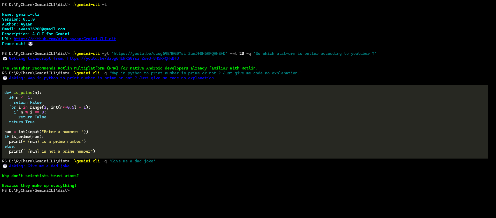

## Gemini CLI: Interact with Google's AI on the Command Line


This is a command-line interface (CLI) for interacting with Google's Gemini large language models (LLMs) using your
Gemini API key. It allows you to:

* **Generate text:**  Prompt Gemini for creative text formats, like poems, code, scripts, musical pieces, email,
  letters, etc.
* **Summarize YouTube videos:** Provide a YouTube URL and get a concise summary of the video content.
* **Ask questions about YouTube videos:**  After summarizing a video, use Gemini's knowledge to answer your questions
  about the content.

## Features:

* Simple and easy-to-use interface
* Integrates with YouTube summaries for informed questioning
* Leverages the power of Google's Gemini LLMs

## Requirements:

* **Gemini API key:** Obtain a key from [https://ai.google.dev/gemini-api/docs/api-key) (Free tier available)

## Installation:

There are two ways to get started with Gemini CLI:

1. **Download a pre-built executable (if available):**

    * Check the project's Releases section on GitHub for downloadable executables (.exe for Windows, etc.). This is the
      easiest option if available for your operating system.
    * Download the appropriate installer for your system and follow the installation instructions.

2. **Build from source (for advanced users or when pre-built executables are not available):**

    * **Prerequisites:**
        * Python 3.x ([https://www.python.org/downloads/](https://www.python.org/downloads/))
    * **Steps:**
        * Clone this repository:

          ```bash
          git clone https://github.com/aiyu-ayaan/Gemini-CLI
          ```
          (Replace `your-username` with your GitHub username)

        * Install dependencies:

          ```bash
          cd Gemini-CLI
          pip install -r requirements.txt
          ```

## Usage:
The Gemini CLI provides several command-line arguments to interact with the tool. Below are the supported arguments and
their descriptions.

## Arguments:

- `--question`, `-q`:
    - Type: `str`
    - Description: The question to ask Gemini.
    - Example: `--question "What is the capital of France?"`

- `--word-limit`, `-wl`:
    - Type: `int`
    - Default: `0`
    - Description: Sets the word limit for the response from Gemini.
    - Example: `--word-limit 50`

- `--info`, `-i`:
    - Action: `InfoAction`
    - Description: Displays information about the Gemini CLI.
    - Example: `--info`

- `--youtube`, `-yt`:
    - Type: `str`
    - Description: YouTube URL to get the transcript from.
    - Example: `--youtube "https://www.youtube.com/watch?v=dQw4w9WgXcQ"`

### Examples:

To summarize a YouTube video, you can use the `-yt`, `-wl`, and `-q` tags together. Below is an example of how to use
these tags:

```bash
python gemini-cli -yt "https://www.youtube.com/watch?v=dQw4w9WgXcQ" -wl 100 -q "Summarize the main points of this video."
```

In this example:

- The `-yt` tag specifies the YouTube URL.
- The `-wl` tag sets a word limit of 100 words for the response.
- The `-q` tag provides the question to ask Gemini, which in this case is to summarize the main points of the video.

## Examples

### Asking a Question

```bash
python gemini-cli -q "What is the weather like today?"
```

### Setting a Word Limit for the Response

```bash
python gemini-cli -q "Explain the theory of relativity." -wl 50
```

### Getting Information About the CLI

```bash
python gemini-cli -i
```

### Summarizing a YouTube Video

```bash
python gemini-cli -yt "https://www.youtube.com/watch?v=dQw4w9WgXcQ"
```

### Asking a Question About a YouTube Video

```bash
python gemini-cli -yt "https://www.youtube.com/watch?v=dQw4w9WgXcQ" -wl 100 -q "What are the main points discussed in this video?"
```

## License

```plaintext
This is free and unencumbered software released into the public domain.

Anyone is free to copy, modify, publish, use, compile, sell, or
distribute this software, either in source code form or as a compiled
binary, for any purpose, commercial or non-commercial, and by any
means.

In jurisdictions that recognize copyright laws, the author or authors
of this software dedicate any and all copyright interest in the
software to the public domain. We make this dedication for the benefit
of the public at large and to the detriment of our heirs and
successors. We intend this dedication to be an overt act of
relinquishment in perpetuity of all present and future rights to this
software under copyright law.

THE SOFTWARE IS PROVIDED "AS IS", WITHOUT WARRANTY OF ANY KIND,
EXPRESS OR IMPLIED, INCLUDING BUT NOT LIMITED TO THE WARRANTIES OF
MERCHANTABILITY, FITNESS FOR A PARTICULAR PURPOSE AND NONINFRINGEMENT.
IN NO EVENT SHALL THE AUTHORS BE LIABLE FOR ANY CLAIM, DAMAGES OR
OTHER LIABILITY, WHETHER IN AN ACTION OF CONTRACT, TORT OR OTHERWISE,
ARISING FROM, OUT OF OR IN CONNECTION WITH THE SOFTWARE OR THE USE OR
OTHER DEALINGS IN THE SOFTWARE.

For more information, please refer to <https://unlicense.org>

```